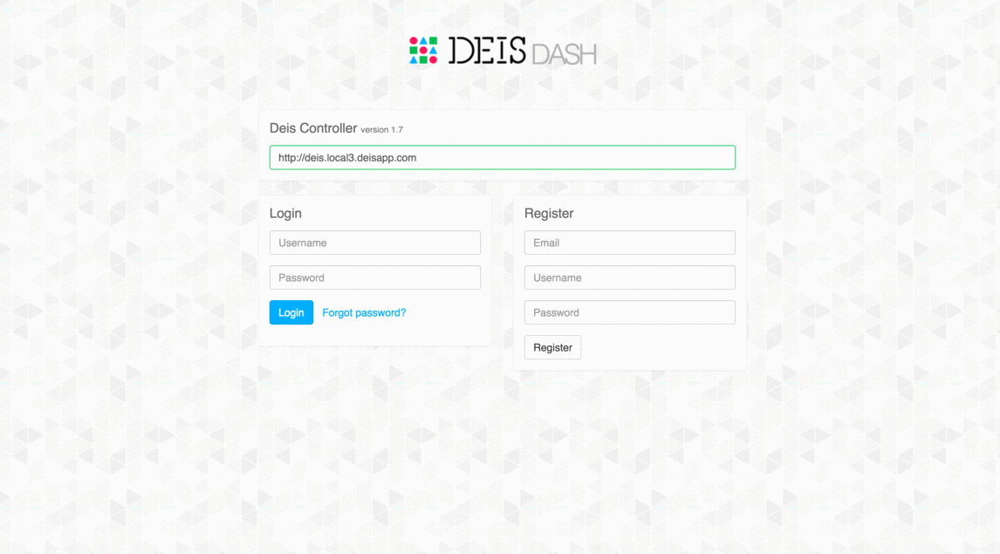

# Deis Dash

Deis Dash is a web based UI for the [Deis PaaS](http://deis.io/).

[Try it now!](http://www.deisdash.com)



Features:

- Login and register
- Change password and manage Git ssh keys
- List users, grant admin, delete user, register user (admin only)
- List and create new apps
- Scale app
- Destroy app
- Edit app configuration
- List app builds
- Add and remove app domain names
- Add and remove app collaborators
- Display and filter app logs

Roadmap:

- Support pagination
- Support for tags, releases, certs, limits

## Install

```bash
# Clone this repository
git clone https://github.com/olalonde/deisdash.git
cd deisdash
# Create Deis app
deis create dash
# Configure app
## tells npm to install devDependencies (needed for build)
deis config:set NPM_CONFIG_PRODUCTION=false
## tells our server to use the built files
deis config:set NODE_ENV=production
# Deploy app
git push deis
# Open Deis Dash in web browser
deis open
```

It was mainly tested on deis v1.12.2. If you find bugs with your version
of Deis, please report them through Github issues.

## Configure

Optional configuration:

To set the default deis controller (by default, deisdash tries to guess
it based on domain).

```
deis config:set \
  DEFAULT_CONTROLLER=https://deis.yourdomain.com \
  CONTROLLER_LOCKED=true
```

Some of those configurations will only take effect when the app is
rebuilt through a git push.

## Development

Deis Dash is a single page app written with React, Redux and Webpack. If
you want to contribute code, try to lint your code with eslint.

To start contributing, make sure you have Node >v5 installed.

```
npm install
# start development server
npm run start
```

## TODO

- Package as docker image with automated docker build?

## License

Copyright 2016 Olivier Lalonde

Licensed under the Apache License, Version 2.0 (the "License"); you may not use this file except in compliance with the License. You may obtain a copy of the License at http://www.apache.org/licenses/LICENSE-2.0

Unless required by applicable law or agreed to in writing, software distributed under the License is distributed on an "AS IS" BASIS, WITHOUT WARRANTIES OR CONDITIONS OF ANY KIND, either express or implied. See the License for the specific language governing permissions and limitations under the License.
